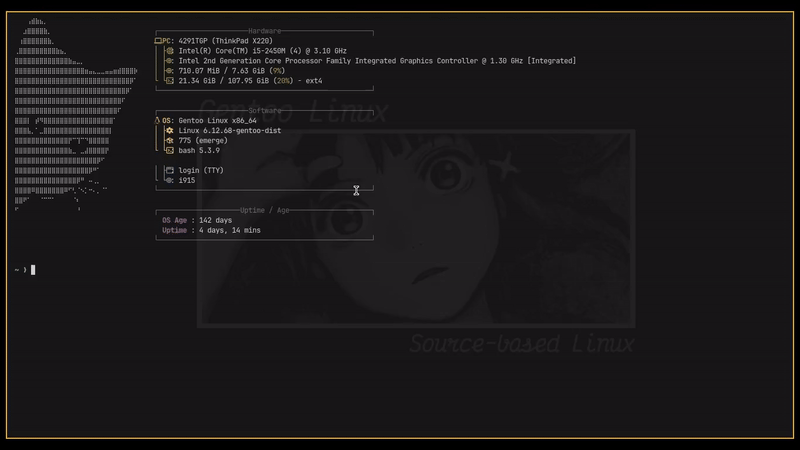

# i3-autotiling-c

Written in C, uses practically zero ram. Works with i3. More tiling behaviours will be implemented in the future.
Inspired by [nwg-piotr](https://github.com/nwg-piotr/autotiling) and [suyjuris](https://github.com/suyjuris/i3ipc-simple).

|  |  |
| :---: | :---: |
| With Autotiling | Without Autotiling |

*This is made for optimization enthusiasts but for normal users too. An autotiler should not consume more ram than needed since it 
runs in the background.*


**Important Note**: Special thanks to both nwg-piotr and suyjuris for their work, for giving me the inspiration but for also having
good documentation making this project possible.

---
## Contents:
1. [Installation](#Installation)
    - [Build from source](#Build-from-source)
    - [How To Uninstall](#How-To-Uninstall)
2. [Usage](#Usage)
3. [Practically Zero Ram Implementation](#Practically-Zero-Ram-Implementation)

---
## Installation
(*If you are not on an x86_64 machine then see [Build from source](#Build-from-source).*)

Run these commands:
```bash
# 1. Download the binary
wget https://github.com/stolen-lighter/i3-autotiling-c/releases/latest/download/i3-autotiling-c

# 2. Make it executable
chmod +x i3-autotiling-c

# 3. Move it to your PATH
mkdir -p ~/.local/bin
mv i3-autotiling-c ~/.local/bin/
```

---
## Build-from-source
### Prerequisites
1. **i3-wm**
2. **Zig toolchain**
3. **The `i3/ipc.h` header file** 

**How to get the `i3/ipc.h` header:**
Depending on your distribution, you might already have this file located at `/usr/include/i3/ipc.h` if you installed i3.
If your compiler throws an error saying the file is missing, you can easily get it using one of two methods:

-   **Method A (Direct Download):** 
    You can download the official header directly from the i3 repository and place it in the correct system folder.
    ```bash
    sudo mkdir -p /usr/include/i3
    sudo wget https://raw.githubusercontent.com/i3/i3/master/include/i3/ipc.h -O /usr/include/i3/ipc.h
    ```

-  **Method B (Package Manager):** 
    Install the i3 development package for your distribution (e.g., `i3-wm-dev` or `libi3-dev` on Debian/Ubuntu-based systems).
    
---
The makefile autodetects the architecture and has 2 basic categories:
1. x86_64-linux-musl  (for x86_64)
2. aarch64-linux-musl (for arm64, aarch64)

*If none of these is the target architecture we don't pass this flag and let the compiler handle it itself*
Most probably will work on other architectures too, but i don't have the hardware to test it.

#### Build commands
```bash
# Clone the repo
git clone git@github.com:stolen-lighter/i3-autotiling-c.git

# Enter project directory
cd i3-autotiling-c

# Compile and install
make install
```

---
## How To Uninstall
### Uninstall commands
```bash
# Enter project directory
cd i3-autotiling-c

# Run the uninstall command
make uninstall
```

## Usage
To start the script just type in your terminal:
```bash
$ i3-autotiling-c
```
*(If this does not work, check that the folder ~/.local/bin is in your PATH)*

If you want it to start with i3 add it to your config file *(most likely located here: `~/.config/i3/`)*,
like this:
```
# < The rest of the config file >
# .....

exec_always --no-startup-id i3-autotiling-c
# .....
```

## Practically Zero Ram Implementation

The Practically Zero Ram Implementation claim is made due to the fact that this is a standalone static binary file.
With Zero extra memory allocations and heavily optimized functions. For more information regarding this claim check out [contributing](contributing.md).
